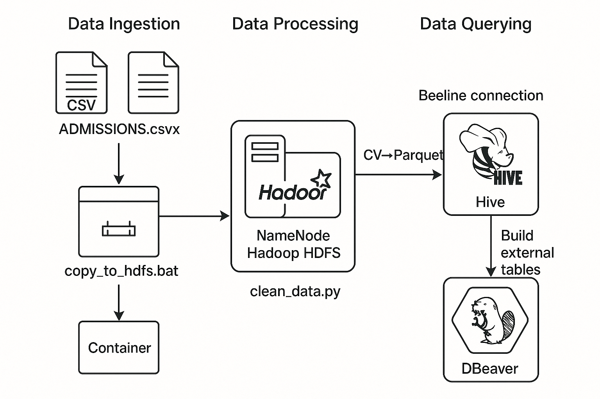

# Big Data Pipeline Architecture for MIMIC-III

This project uses Docker to simulate a distributed data processing pipeline using:
- Hadoop HDFS for storage
- Spark for transformation
- Hive for SQL-based analytics

## Components:

- Docker: containerization
- HDFS: stores raw & processed data
- Spark: runs PySpark jobs
- Hive: runs analytical queries on Parquet files

## Data Flow Diagram

### 1. **Data Ingestion**
- Raw CSV files from the MIMIC-III dataset (e.g., ADMISSIONS.csv, PATIENTS.csv) are copied into HDFS using a script (`copy_to_hdfs.bat` or `docker cp + hdfs dfs -put`).

### 2. **Data Cleansing with PySpark**
- Each table (ADMISSIONS, PATIENTS, etc.) is processed:
  - Remove nulls and invalid rows
  - Normalize values (e.g., gender, diagnosis) 
  - Convert formats (e.g., dates, timestamps)
  - Write as Parquet files to `/clinical_db_transformed/` in HDFS

### 3. **Data Querying with Hive**
- External Hive tables are created over the Parquet files.
- Analytical SQL queries are used to:
  - Analyze ICU readmission
  - Track mortality patterns
  - Group diagnoses by length of stay
